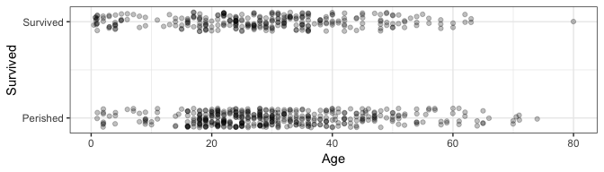
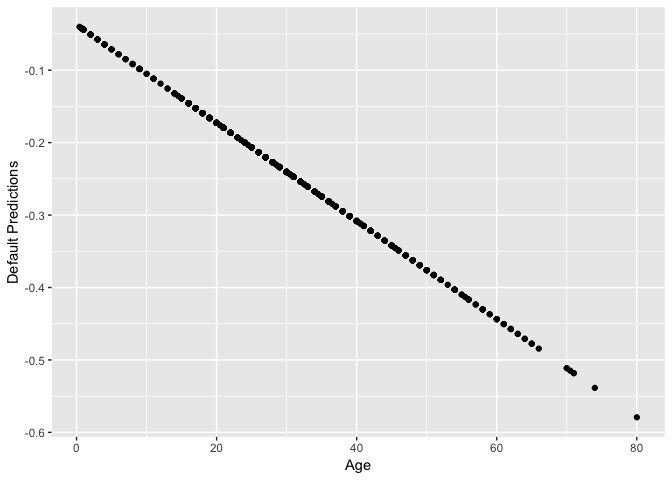
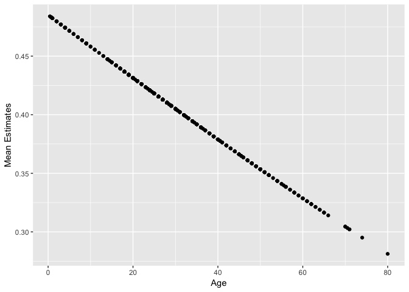
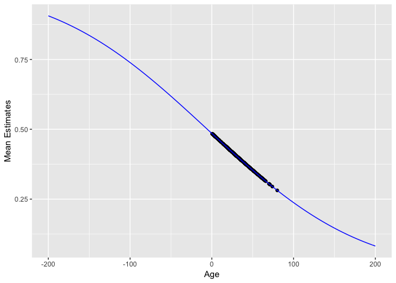

GLM's in R
================

This document introduces the `glm()` function in R for fitting a Generlized Linear Model (GLM). We'll work with the `titanic_train` dataset in the `titanic` package.

``` r
library(tidyverse)
```

    ## ── Attaching packages ────────────────────────────────────────────────────────────── tidyverse 1.2.1 ──

    ## ✔ ggplot2 3.1.0     ✔ purrr   0.2.5
    ## ✔ tibble  1.4.2     ✔ dplyr   0.7.6
    ## ✔ tidyr   0.8.1     ✔ stringr 1.3.1
    ## ✔ readr   1.1.1     ✔ forcats 0.3.0

    ## ── Conflicts ───────────────────────────────────────────────────────────────── tidyverse_conflicts() ──
    ## ✖ dplyr::filter() masks stats::filter()
    ## ✖ dplyr::lag()    masks stats::lag()

``` r
library(broom)
library(titanic)
dat <- na.omit(titanic_train)
str(dat)
```

    ## 'data.frame':    714 obs. of  12 variables:
    ##  $ PassengerId: int  1 2 3 4 5 7 8 9 10 11 ...
    ##  $ Survived   : int  0 1 1 1 0 0 0 1 1 1 ...
    ##  $ Pclass     : int  3 1 3 1 3 1 3 3 2 3 ...
    ##  $ Name       : chr  "Braund, Mr. Owen Harris" "Cumings, Mrs. John Bradley (Florence Briggs Thayer)" "Heikkinen, Miss. Laina" "Futrelle, Mrs. Jacques Heath (Lily May Peel)" ...
    ##  $ Sex        : chr  "male" "female" "female" "female" ...
    ##  $ Age        : num  22 38 26 35 35 54 2 27 14 4 ...
    ##  $ SibSp      : int  1 1 0 1 0 0 3 0 1 1 ...
    ##  $ Parch      : int  0 0 0 0 0 0 1 2 0 1 ...
    ##  $ Ticket     : chr  "A/5 21171" "PC 17599" "STON/O2. 3101282" "113803" ...
    ##  $ Fare       : num  7.25 71.28 7.92 53.1 8.05 ...
    ##  $ Cabin      : chr  "" "C85" "" "C123" ...
    ##  $ Embarked   : chr  "S" "C" "S" "S" ...
    ##  - attr(*, "na.action")= 'omit' Named int  6 18 20 27 29 30 32 33 37 43 ...
    ##   ..- attr(*, "names")= chr  "6" "18" "20" "27" ...

Consider the regression of `Survived` on `Age`. Let's take a look at the data with jitter:

``` r
ggplot(dat, aes(Age, Survived)) +
    geom_jitter(height=0.1, alpha=0.25) +
    scale_y_continuous(breaks=0:1, labels=c("Perished", "Survived")) +
    theme_bw()
```



Recall that the linear regression can be done with the `lm` function:

``` r
res_lm <- lm(Survived ~ Age, data=dat)
summary(res_lm)
```

    ## 
    ## Call:
    ## lm(formula = Survived ~ Age, data = dat)
    ## 
    ## Residuals:
    ##     Min      1Q  Median      3Q     Max 
    ## -0.4811 -0.4158 -0.3662  0.5789  0.7252 
    ## 
    ## Coefficients:
    ##              Estimate Std. Error t value Pr(>|t|)    
    ## (Intercept)  0.483753   0.041788  11.576   <2e-16 ***
    ## Age         -0.002613   0.001264  -2.067   0.0391 *  
    ## ---
    ## Signif. codes:  0 '***' 0.001 '**' 0.01 '*' 0.05 '.' 0.1 ' ' 1
    ## 
    ## Residual standard error: 0.4903 on 712 degrees of freedom
    ## Multiple R-squared:  0.005963,   Adjusted R-squared:  0.004567 
    ## F-statistic: 4.271 on 1 and 712 DF,  p-value: 0.03912

In this case, the regression line is `0.4837526` + `-0.0026125` `Age`.

A GLM can be fit in a similar way, using the `glm` function -- we just need to indicate what type of regression we're doing (binomial? poission?) and the link function. We are doing bernoulli (binomial) regression, since the response is binary (0 or 1); lets choose a `probit` link function.

``` r
res_glm <- glm(factor(Survived) ~ Age, data=dat, family=binomial(link="probit"))
```

The `family` argument takes a **function**, indicating the type of regression. See `?family` for the various types of regression allowed by `glm()`.

Let's see a summary of the GLM regression:

``` r
summary(res_glm)
```

    ## 
    ## Call:
    ## glm(formula = factor(Survived) ~ Age, family = binomial(link = "probit"), 
    ##     data = dat)
    ## 
    ## Deviance Residuals: 
    ##     Min       1Q   Median       3Q      Max  
    ## -1.1477  -1.0363  -0.9549   1.3158   1.5929  
    ## 
    ## Coefficients:
    ##              Estimate Std. Error z value Pr(>|z|)  
    ## (Intercept) -0.037333   0.107944  -0.346   0.7295  
    ## Age         -0.006773   0.003294  -2.056   0.0397 *
    ## ---
    ## Signif. codes:  0 '***' 0.001 '**' 0.01 '*' 0.05 '.' 0.1 ' ' 1
    ## 
    ## (Dispersion parameter for binomial family taken to be 1)
    ## 
    ##     Null deviance: 964.52  on 713  degrees of freedom
    ## Residual deviance: 960.25  on 712  degrees of freedom
    ## AIC: 964.25
    ## 
    ## Number of Fisher Scoring iterations: 4

We can make predictions too, but this is not as straight-forward as in `lm()` -- here are the "predictions" using the `predict()` generic function:

``` r
pred <- predict(res_glm)
qplot(dat$Age, pred) + labs(x="Age", y="Default Predictions")
```



Why the negative predictions? It turns out this is just the linear predictor, `-0.0373331` + `-0.0067733` `Age`.

The documentation for the `predict()` generic function on `glm` objects can be found by typing `?predict.glm`. Notice that the `predict()` generic function allows you to specify the *type* of predictions to be made. To make predictions on the mean (probability of `Survived=1`), indicate `type="response"`, which is the equivalent of applying the inverse link function to the linear predictor.

Here are those predictions again, this time indicating `type="response"`:

``` r
pred <- predict(res_glm, type="response")
qplot(dat$Age, pred) + labs(x="Age", y="Mean Estimates")
```



Look closely -- these predictions don't actually fall on a straight line. They follow an inverse probit function (i.e., a Gaussian cdf):

``` r
mu <- function(x) pnorm(res_glm$coefficients[1] + res_glm$coefficients[2] * x)
qplot(dat$Age, pred) + 
    labs(x="Age", y="Mean Estimates") +
    stat_function(fun=mu, colour="blue") +
    scale_x_continuous(limits=c(-200, 200))
```



### `broom::augment()`

We can use the `broom` package on `glm` objects, too. But, just like we had to specify `type="response"` when using the `predict()` function in order to evaluate the model function, so to do we have to specify something in the `broom::augment()` function. Here, the `type.predict` argument gets passed to the `predict()` generic function (actually, the `predict.glm()` method). This means that indicating `type.predict="response"` will evaluate the model function:

``` r
res_glm %>% 
  augment(type.predict = "response") %>% 
  head()
```

    ## # A tibble: 6 x 10
    ##   .rownames factor.Survived.   Age .fitted .se.fit .resid    .hat .sigma
    ##   <chr>     <fct>            <dbl>   <dbl>   <dbl>  <dbl>   <dbl>  <dbl>
    ## 1 1         0                   22   0.426  0.0209 -1.05  0.00179   1.16
    ## 2 2         1                   38   0.384  0.0211  1.38  0.00188   1.16
    ## 3 3         1                   26   0.415  0.0190  1.33  0.00149   1.16
    ## 4 4         1                   35   0.392  0.0196  1.37  0.00160   1.16
    ## 5 5         0                   35   0.392  0.0196 -0.997 0.00160   1.16
    ## 6 7         0                   54   0.343  0.0345 -0.917 0.00528   1.16
    ## # ... with 2 more variables: .cooksd <dbl>, .std.resid <dbl>
