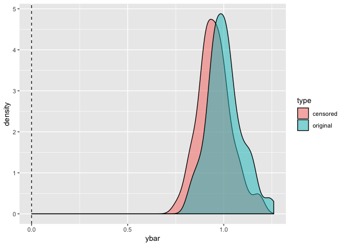

```r
suppressPackageStartupMessages(library(tidyverse))
```


### Learning objectives

- Understand and identify whether data is censored.
- Understand the consequences of subsetting to uncensored data, and of ignoring the censored property.
- Identify at least one way to incorporate the censored property of some data when fitting a model. 
- Understand and be able to explain the difference between the proportional hazards model, and the accelerated failure time model.
- Understand how the amount of censoring influences model goodness. 

## Motivating Example: two-group comparison

A study investigated the rate of infection of two catheter implantation methods. Here are the data.

_Reference_: Section 1.4, John P. Klein, Melvin L. Moeschberger. (2003) "Survival Analysis: Techniques for Censored and Truncated Data"

| Method | Infection Times (months) |
| ------ | ------------------------ |
| Surgically Placed Catheter | <p> Infected: 1.5, 3.5, 4.5, 4.5, 5.5, 8.5, 8.5, 9.5, 10.5, 11.5, 15.5, 16.5, 18.5, 23.5, 26.5 <p> Not yet infected: 2.5, 2.5, 3.5, 3.5, 3.5, 4.5, 5.5, 6.5, 6.5, 7.5, 7.5, 7.5, 7.5, 8.5, 9.5, 10.5, 11.5, 12.5, 12.5, 13.5, 14.5, 14.5, 21.5, 21.5, 22.5, 22.5, 25.5, 27.5 |
| Percutaneous Placed Catheter | <p> Infected: 0.5, 0.5, 0.5, 0.5, 0.5, 0.5, 2.5, 2.5, 3.5, 6.5, 15.5 <p> Not yet infected: 0.5, 0.5, 0.5, 0.5, 0.5, 0.5, 0.5, 0.5, 0.5, 0.5, 1.5, 1.5, 1.5, 1.5, 2.5, 2.5, 2.5, 2.5, 2.5, 3.5, 3.5, 3.5, 3.5, 3.5, 4.5, 4.5, 4.5, 5.5, 5.5, 5.5, 5.5, 5.5, 6.5, 7.5, 7.5, 7.5, 8.5, 8.5, 8.5, 9.5, 9.5, 10.5, 10.5, 10.5, 11.5, 11.5, 12.5, 12.5, 12.5, 12.5, 14.5, 14.5, 16.5, 16.5, 18.5, 19.5, 19.5, 19.5, 20.5, 22.5, 24.5, 25.5, 26.5, 26.5, 28.5 |

We would like to know, which method results in sooner infection? 

The data are stored in a `tibble` below.


```r
library(tidyverse)
dat <- list(
    surgical=
    list(
        observed = c(1.5, 3.5, 4.5, 4.5, 5.5, 8.5, 8.5, 9.5, 10.5, 11.5, 15.5, 16.5, 18.5, 23.5, 26.5),
        ongoing  = c(2.5, 2.5, 3.5, 3.5, 3.5, 4.5, 5.5, 6.5, 6.5, 7.5, 7.5, 7.5, 7.5, 8.5, 9.5, 10.5, 11.5, 12.5, 12.5, 13.5, 14.5, 14.5, 21.5, 21.5, 22.5, 22.5, 25.5, 27.5)
    ),
    percutaneous=
    list(
        observed = c(0.5, 0.5, 0.5, 0.5, 0.5, 0.5, 2.5, 2.5, 3.5, 6.5, 15.5),
        ongoing  = c(0.5, 0.5, 0.5, 0.5, 0.5, 0.5, 0.5, 0.5, 0.5, 0.5, 1.5, 1.5, 1.5, 1.5, 2.5, 2.5, 2.5, 2.5, 2.5, 3.5, 3.5, 3.5, 3.5, 3.5, 4.5, 4.5, 4.5, 5.5, 5.5, 5.5, 5.5, 5.5, 6.5, 7.5, 7.5, 7.5, 8.5, 8.5, 8.5, 9.5, 9.5, 10.5, 10.5, 10.5, 11.5, 11.5, 12.5, 12.5, 12.5, 12.5, 14.5, 14.5, 16.5, 16.5, 18.5, 19.5, 19.5, 19.5, 20.5, 22.5, 24.5, 25.5, 26.5, 26.5, 28.5)
    )) %>% 
    map(enframe, name="meas_type", value="time") %>% 
    enframe(name="method") %>% 
    unnest() %>% 
    unnest()
sample_n(dat, 10)
```

```
## # A tibble: 10 x 3
##    method       meas_type  time
##    <chr>        <chr>     <dbl>
##  1 percutaneous ongoing    10.5
##  2 percutaneous ongoing     6.5
##  3 percutaneous ongoing    10.5
##  4 surgical     ongoing     5.5
##  5 surgical     ongoing     6.5
##  6 percutaneous ongoing     7.5
##  7 percutaneous observed    3.5
##  8 surgical     ongoing     7.5
##  9 percutaneous ongoing    26.5
## 10 percutaneous ongoing     0.5
```

__Discussion__: "Good or bad", can you think of a way to estimate the mean time until infection for both methods? What do you think the pros and cons are to this method?

This will recieve a more rigorous treatment later in this lecture.

### Other Examples

1. __Churn__. You want to keep subscribers to your YouTube channel. Google has given you the subscription date and drop-out date (if applicable) for all subscribers you've ever had.
2. __Light Bulbs__. You've designed a new light bulb, and wish to tell buyers how long they will last. 
3. 

### The Monkey Wrench: censored data

All of these examples have response variables of the type "time until event". They are all characterized by the duration of time between the _start moment_ and _end moment_.

The monkey wrench: we don't know the complete duration for all cases!

- A measurement is __right-censored__ if we know the duration is _at least_ some number.
- A measurement is __left-censored__ if we know the duration is _at most_ some number.

Data that contains censored observations is called _survival data_. 

In this course, we will concern ourselves with __right-censored__ data, because they are more prominent, and because methods for left-censored data are similar.

Note that it's sometimes valuable to be even more descriptive with the type of observation, such as distinguishing _truncated_ data. We won't consider this.

## Naive Approach to Analyses with Censored Data

### Ignoring the censoring

Let's consider two naive approaches to the catheter example.

__1\. Removing censored observations__

Let's estimate the mean for both methods by removing the censored data:


```r
dat %>% 
    filter(meas_type == "observed") %>% 
    group_by(method) %>% 
    summarize(mean = mean(time),
              se   = sd(time)/sqrt(length(time)))
```

```
## # A tibble: 2 x 3
##   method        mean    se
##   <chr>        <dbl> <dbl>
## 1 percutaneous  3.05  1.37
## 2 surgical     11.2   1.93
```

Problems (?):

- The mean estimate _might be_ artificially small (biased)!
    - Case: Perhaps uncensored observations are more likely to be smaller. This might be the case if your study only runs for a short amount of time, not allowing tail observations to be expressed.
- We are throwing away information in the form of censored data. We could achieve a smaller SE if we use the information contained in the censored data!

__2\. Use the censored observations, but ignore the fact that they are censored__

Ignoring the censoring:


```r
dat %>% 
    group_by(method) %>% 
    summarize(mean = mean(time),
              se   = sd(time)/sqrt(length(time)))
```

```
## # A tibble: 2 x 3
##   method        mean    se
##   <chr>        <dbl> <dbl>
## 1 percutaneous  7.99 0.883
## 2 surgical     11.3  1.12
```

Problems:

- The mean estimate _is_ artificially small (biased). This is because the data set contains some artificially small observations (remember, the censored data are actually larger in reality).
- Our measure of certainty (here, the SE estimate) is also artificially small. The censored data don't contain as much information as regular data, so they don't lower the SE as much.

Simulation??:


```r
## Use the `infer` package???
prop <- 0.1
n <- 100
N <- 100
ncens <- round(prop*n)
ybars_orig <- numeric()
ybars_cens <- numeric()
for (i in 1:N) {
    y <- rexp(n)
    ybars_orig[i] <- mean(y)
    u <- runif(ncens)
    y[seq_len(ncens)] <- y[seq_len(ncens)] * u
    ybars_cens[i] <- mean(y)
}
tibble(original=ybars_orig, censored=ybars_cens) %>%
    gather(type, ybar) %>%
    ggplot(aes(x=ybar)) +
    geom_density(aes(group=type, fill=type), alpha=0.5) +
    geom_vline(xintercept=0, linetype="dashed")
```

<!-- -->

